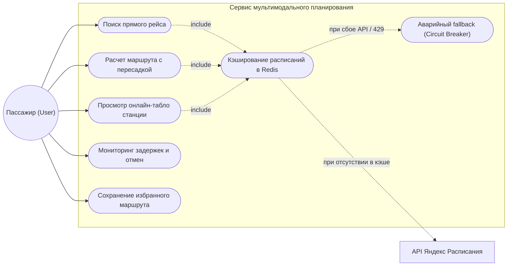
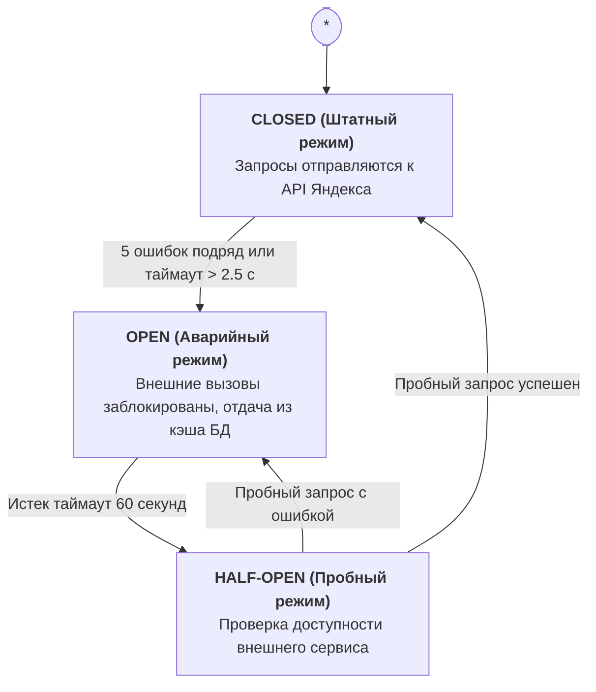

# Этап 2. Выработка требований (Requirements Specification)

**Проект**: Сервис мультимодального планирования пригородных поездок (электрички + пересадки) с учетом задержек и отмен  
**Курс**: Конструирование программного обеспечения (КПО, СПбПУ)  
**Исполнитель**: Спиридонов Михаил Павлович (гр. 5130904/40108)  
**Преподаватель**: Юркин В. А.

---

## 1. Определение проблемы и цель проекта

### 1.1. Суть проблемы
Пассажиры пригородных электропоездов Санкт-Петербурга и Ленинградской области регулярно сталкиваются с опозданиями, отменами рейсов и срывом пересадок из-за несогласованности расписаний и внезапных технологических задержек. Существующие агрегаторы перегружены рекламой, не предлагают прозрачных сценариев мультимодальных стыковок и перестают отвечать при пиковых нагрузках или сбоях внешних поставщиков информации. Сервис автоматизирует построение сквозных маршрутов с пересадками, непрерывно валидирует оперативные задержки и обеспечивает гарантированный доступ к данным за счет агрессивного кэширования и деградации функционала.

### 1.2. Целевая аудитория
1. **Маятниковые пассажиры**: ежедневные поездки из пригородов (Выборг, Зеленогорск, Гатчина, Павловск, Тосно) в центр СПб на работу/учебу.
2. **Пассажиры сквозных маршрутов**: поездки между радиальными направлениями со сменой поездов на узловых станциях (Девяткино, Удельная, Обухово, Рыбацкое).
3. **Дачники и туристы**: сезонные и выходные поездки с повышенной чувствительностью к отменам и изменениям выходного дня.

---

## 2. Пользовательские сценарии (User Stories)

### User Story 1: Поиск оптимального стыковочного маршрута
* **Формулировка**:  
  *Как* пассажир, планирующий поездку между станциями разных направлений (например, Зеленогорск → Ораниенбаум),  
  *я хочу* получить варианты маршрутов с электропоездами и пересадками с указанием гарантированного времени на переход между платформами (не менее 7 минут),  
  *чтобы* успеть на стыковочный поезд даже при небольшом отклонении первого состава от графика.
* **Критерии приемки (Acceptance Criteria)**:
  * **Scenario 1.1**: Прямой рейс. Если между станциями есть прямой поезд, он выводится в топе с пометкой «Без пересадок».
  * **Scenario 1.2**: Маршрут с пересадкой. Алгоритм рассчитывает стыковки на узловых вокзалах/станциях. Окно пересадки строго удовлетворяет условию: от 5 до 45 минут. Стыковки длительностью менее 5 минут отбрасываются как физически нереализуемые.
  * **Scenario 1.3**: Информация о пересадке. В карточке маршрута четко отображается: станция пересадки, время ожидания, путь/платформа прибытия и отправления (при наличии данных).

---

### User Story 2: Оперативное информирование об отменах и задержках
* **Формулировка**:  
  *Как* пассажир пригородного сообщения в часы пик,  
  *я хочу* в один клик видеть фактический статус рейса, величину задержки и актуальные отмены по выбранной станции,  
  *чтобы* своевременно скорректировать время выхода и избежать ожидания на холодной платформе.
* **Критерии приемки (Acceptance Criteria)**:
  * **Scenario 2.1**: Цветовая индикация. 
    * `ON_TIME` (зеленый) — отклонение от графика менее 2 минут.
    * `DELAYED` (желтый/красный) — задержка с явным указанием: «Опаздывает на N мин».
    * `CANCELLED` (красный зачеркнутый) — рейс отменен технологическим «окном» РЖД.
  * **Scenario 2.2**: Пересчет пересадки. При фиксации задержки первого поезда система автоматически проверяет возможность успеть на стыковочный состав. Если окно пересадки становится менее 3 минут, выводится предупреждение: «Высокий риск срыва пересадки».

---

### User Story 3: Отказоустойчивый доступ к расписанию при сбое внешнего API (Circuit Breaker)
* **Формулировка**:  
  *Как* пользователь сервиса в момент технического сбоя поставщика данных (Яндекс Расписания) или исчерпания суточных лимитов API,  
  *я хочу* продолжать получать базовое расписание и планировать поездки без появления 500-х ошибок,  
  *чтобы* сервис оставался полезным и доступным даже в нештатных ситуациях.
* **Критерии приемки (Acceptance Criteria)**:
  * **Scenario 3.1**: Прозрачная деградация (Graceful Degradation). При недоступности внешнего API сервис отдает закэшированное базовое расписание из локальной базы данных PostgreSQL / Redis.
  * **Scenario 3.2**: Информирование пользователя. В верхней части интерфейса отображается информационный баннер: *«Внимание: внешняя система временно недоступна. Показано базовое расписание, оперативные статусы задержек могут быть неактуальны»*.
  * **Scenario 3.3**: Скорость ответа. В аварийном режиме время отклика системы не превышает 30 мс (за счет отдачи из кэша).

---

### User Story 4 (Дополнительная): Сохранение избранных маршрутов
* **Формулировка**:  
  *Как* регулярный пассажир,  
  *я хочу* сохранить домашний маршрут (например, «Удельная ↔ Рощино») в избранное,  
  *чтобы* при открытии приложения сразу видеть табло ближайших 3 поездов без повторного ввода станций.

---

## 3. Диаграмма прецедентов (Use Case Diagram)

---

## 4. Масштаб системы и оценка нагрузки

* **Целевой масштаб**: от **10 000 уникальных пользователей в сутки** (DAU).
* **Профиль пользовательской активности**:
  * В среднем каждый пользователь совершает 8–12 запросов в день (поиск утреннего маршрута, проверка вечернего табло, обновление статуса перед выходом).
  * Суточный объем запросов к системе: 10 000 × 10 = 100 000 запросов в сутки.
* **Расчет RPS (Requests Per Second)**:
  * **Средний дневной RPS**:  
    `RPS_avg = 100 000 / 86 400 ≈ 1.16 req/s`
  * **Пиковый коэффициент**: транспортные системы характеризуются ярко выраженными утренними (07:30–09:30) и вечерними (17:30–19:30) часами пик, на которые приходится до 65% суточного трафика.
  * **Пиковый RPS**:  
    `RPS_peak = 65 000 / (4 × 3600) ≈ 4.5 req/s (базовый пик)`  
    С учетом возможных всплесков при массовых задержках и сбоях расчетный запас системы проектируется на **25–30 RPS**.

---

## 5. Отказоустойчивость (Fault Tolerance)

### 5.1. Анализ рисков внешней зависимости
Внешний источник — **API Яндекс Расписания** (тариф разработчика):
* **Жесткое ограничение**: 500 запросов в сутки. При прямых прокси-запросах от 10 000 пользователей квота будет исчерпана за первые 5 минут работы.
* **Внешние сетевые сбои**: задержки на магистральных каналах, таймауты, ошибки 502/503/504 на стороне Яндекса.

### 5.2. Архитектура отказоустойчивости
1. **Многоуровневое кэширование**:
   * *Уровень 1 (In-Memory / Redis)*: суточные матрицы расписаний станций СПб прогреваются регламентным воркером в ночные часы и кэшируются на 24 часа. Оперативные статусы кэшируются на 2–3 минуты.
   * *Уровень 2 (PostgreSQL fallback)*: базовый нормативный график движения хранится в реляционной базе данных как эталон.
2. **Паттерн Circuit Breaker**:
   * Для обращений к внешнему API настраивается конечный автомат состояний (библиотека `aiobreaker` в Python):
     * **CLOSED**: штатный режим. Все внешние запросы выполняются. Ошибки подсчитываются скользящим окном.
     * **OPEN**: при достижении порога в 5 последовательных таймаутов (>2.5 с) или кодов 429/5xx автомат размыкает цепь на 60 секунд. Запросы к API Яндекса не отправляются вовсе, экономя время и ресурсы. Вызовы мгновенно перенаправляются на PostgreSQL fallback.
     * **HALF-OPEN**: по истечении 60 секунд пропускается 1 тестовый запрос. При успехе цепь замыкается (`CLOSED`), при неудаче — снова размыкается (`OPEN`).

### 5.3. Автомат состояний Circuit Breaker (State Diagram)

