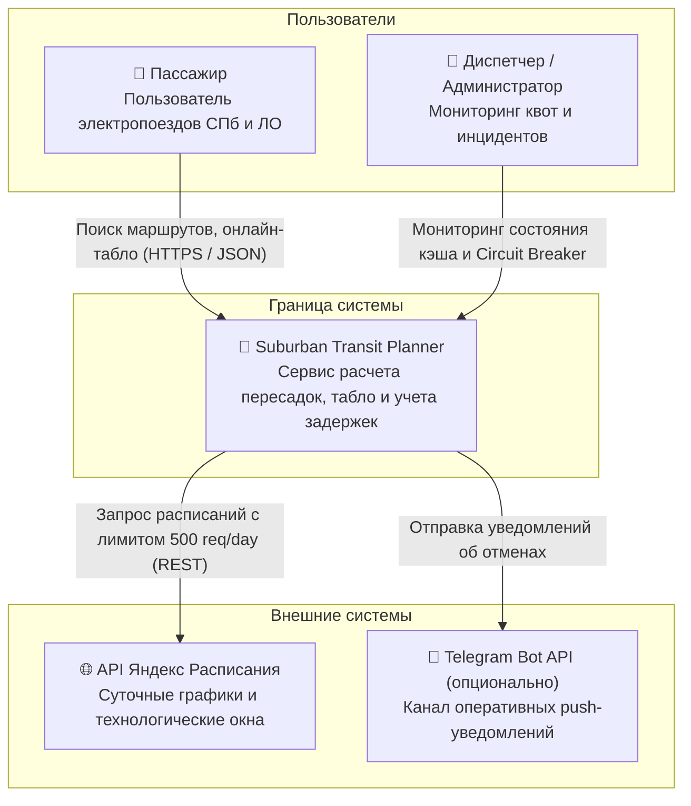
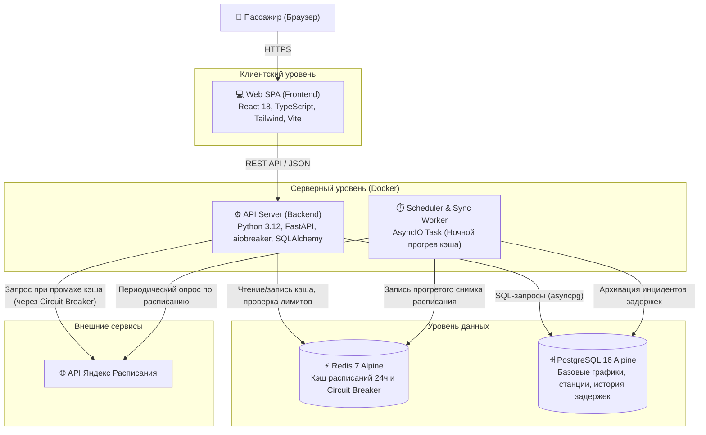
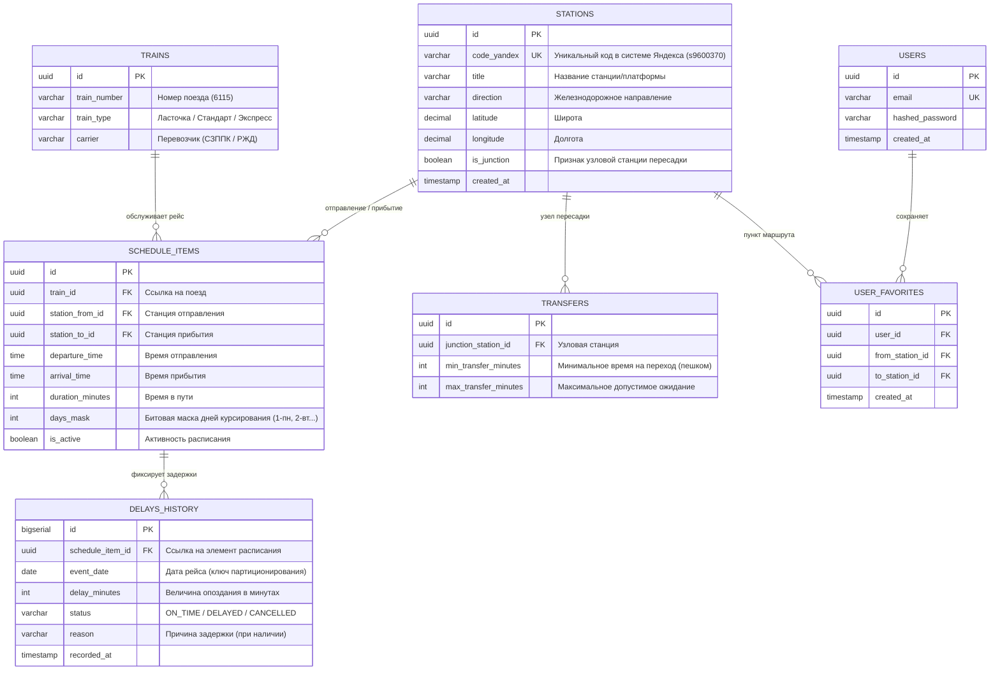
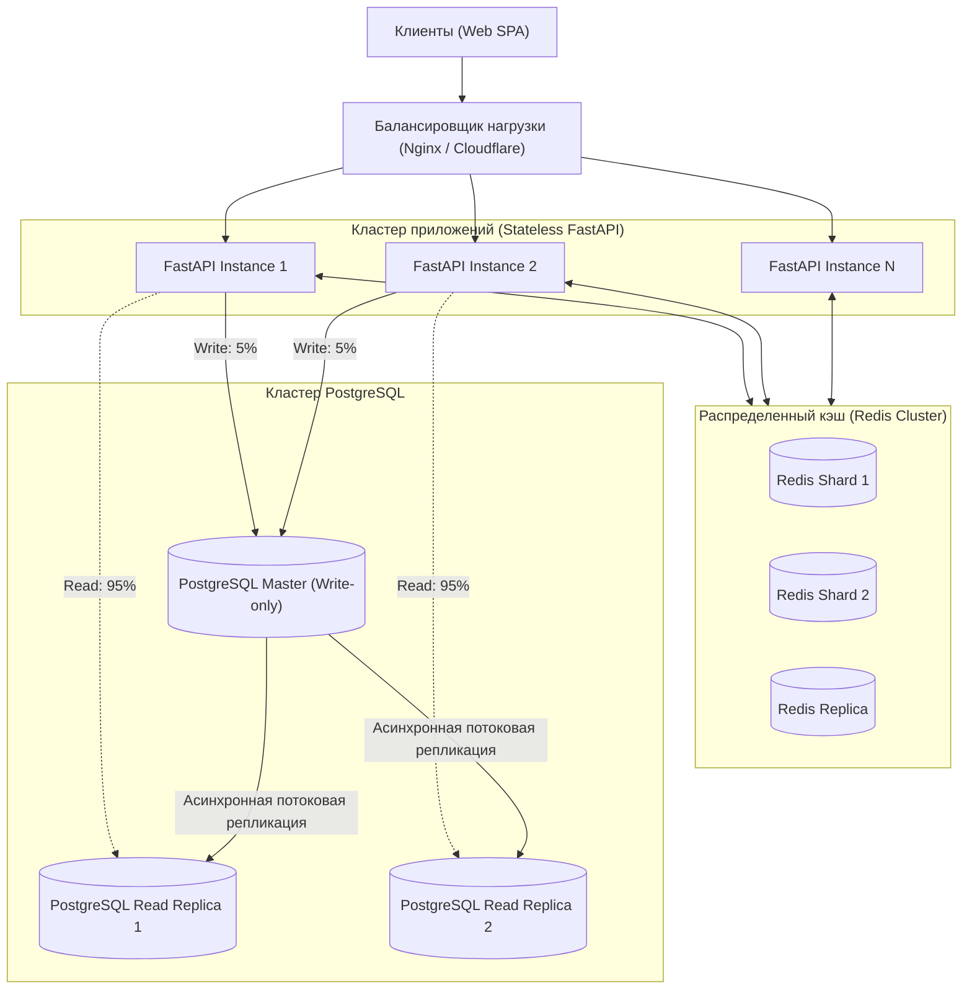

# Этап 3. Разработка архитектуры и детальное проектирование (Architecture & Design)

**Проект**: Сервис мультимодального планирования пригородных поездок (электрички + пересадки) с учетом задержек и отмен  
**Курс**: Конструирование программного обеспечения (КПО, СПбПУ)  
**Исполнитель**: Спиридонов Михаил Павлович (гр. 5130904/40108)  
**Преподаватель**: Юркин В. А.

---

## 1. Анализ нагрузок (Capacity Planning)

### 1.1. Соотношение Read/Write нагрузки
Специфика транспортного информационного сервиса определяет критическое преобладание операций чтения:
* **Read (95% операций)**:
  * Поиск оптимальных маршрутов между станциями.
  * Запрос онлайн-табло вокзалов и промежуточных платформ.
  * Проверка текущих оперативных задержек.
* **Write (5% операций)**:
  * Добавление станций и маршрутов в список избранного пользователя.
  * Регистрация пользовательских подписок на алерты об отменах.
  * Системная запись истории задержек регламентным фоновым воркером.
  * Системные журналы аудита (access log, security events).

---

### 1.2. Расчет объемов сетевого трафика
* **Исходные данные**:
  * Количество активных пользователей: `N = 10 000 DAU`.
  * Среднее число запросов на пользователя: `q = 12 запросов в день`.
  * Суммарное число запросов в сутки: `Q = 120 000 запросов в день`.
* **Размеры сетевых пакетов**:
  * Средний входящий HTTP-запрос (заголовки + параметры): `S_req ≈ 0.8 КБ`.
  * Средний исходящий JSON-ответ (список сегментов рейса, остановки, пересадка): `S_resp ≈ 4.5 КБ`.
* **Суточные объемы трафика**:
  * **Исходящий трафик пользователям**:  
    `V_out = 120 000 × 4.5 КБ = 540 000 КБ ≈ 527.3 МБ/сутки`
  * **Входящий трафик от пользователей**:  
    `V_in = 120 000 × 0.8 КБ = 96 000 КБ ≈ 93.8 МБ/сутки`
  * **Трафик синхронизации с API Яндекс Расписаний**:  
    Воркер выполняет регламентные запросы расписаний по 5 вокзалам СПб и 12 ключевым веткам. Суточный объем обмена с Яндексом: `≈ 45 МБ/сутки`.
  * **Суммарный суточный трафик**: `≈ 666 МБ/сутки` (`≈ 20 ГБ/месяц`).
* **Требуемая пропускная способность канала (Bandwidth)**:
  * В средний период: `540 МБ / 86 400 с ≈ 6.25 КБ/с ≈ 50 Кбит/с`.
  * В пиковый период (30 RPS):  
    `BW_peak = 30 req/s × 4.5 КБ = 135 КБ/с ≈ 1.08 Мбит/с`.
  * *Вывод*: даже стандартного 100-мегабитного сетевого интерфейса виртуального сервера достаточно с запасом более чем в 90 раз.

---

### 1.3. Расчет дисковой системы с учетом хранения данных > 5 лет

Требование ТЗ: обеспечение хранения накопленных исторических данных за период не менее 5 лет (`T = 5 × 365 = 1825 дней`).

| Таблица / Сущность | Прирост в сутки (строк) | Размер строки | Прирост в сутки (КБ) | Объем за 5 лет (чистые данные) |
| :--- | :--- | :--- | :--- | :--- |
| **`stations`** (станции и платформы) | 0 (статично ~450 станций) | 250 байт | 0 | **112 КБ** |
| **`trains`** (типы и номера составов) | 0 (статично ~1 200 поездов) | 200 байт | 0 | **240 КБ** |
| **`schedule_items`** (базовое расписание) | 0 (норматив ~15 000 рейсов) | 300 байт | 0 | **4.5 МБ** |
| **`delays_history`** (зафиксированные задержки) | ~2 500 записей/день | 320 байт | 800 КБ | **1.46 ГБ** |
| **`user_favorites`** (избранные маршруты) | ~50 записей/день | 120 байт | 6 КБ | **11 МБ** |
| **`audit_access_logs`** (журнал посещений и алертов) | ~120 000 записей/день | 110 байт | 13 200 КБ | **24.09 ГБ** |
| **ИТОГО чистые данные**: | — | — | **≈ 14 МБ/день** | **~25.56 ГБ** |

* **Индексы и накладные расходы PostgreSQL**:
  * Накладные расходы на заголовки строк, B-Tree индексы и таблицы MVCC составляют около 40% от объема данных:  
    `V_indexes = 25.56 ГБ × 0.40 ≈ 10.22 ГБ`
* **Суммарный объем дисковой системы на 5 лет**:  
  `V_total = 25.56 + 10.22 ≈ 35.8 ГБ`
* **Архитектурное решение**:
  * Таблица `delays_history` секционируется по годам: `PARTITION BY RANGE (event_date)`.
  * Старые партиции старше 3 лет архивируются в сжатые read-only таблицы (PostgreSQL `pg_dump` или сжатие TOAST), что гарантирует работу рабочей БД в пределах стандартного SSD-накопителя на 50–80 ГБ.

---

## 2. Архитектурные схемы (C4 Model)

### 2.1. C4 — Уровень 1: Context Diagram (Диаграмма системного контекста)

Диаграмма отображает границы сервиса и его взаимодействие с пользователями и внешними системами.



---

### 2.2. C4 — Уровень 2: Container Diagram (Диаграмма контейнеров)

Диаграмма детализирует внутреннюю компоновку системы, протоколы взаимодействия и хранилища данных.



---

## 3. Контракты API (REST Endpoints & SLA)

Сервис реализует спецификацию REST API на базе стандартов OpenAPI 3.1 (FastAPI).

### 3.1. Спецификация ключевых эндпоинтов

#### 1. `GET /api/v1/stations`
* **Назначение**: Получение каталога станций Санкт-Петербургского железнодорожного узла для выпадающих списков интерфейса.
* **Параметры**: `direction` (опционально: `finlyandsky`, `baltiysky`, `moskovsky` и т.д.).
* **Формат ответа (200 OK)**:
```json
[
  {
    "id": "7f1e4b8a-3c2d-4e5f-a6b7-8c9d0e1f2a3b",
    "code_yandex": "s9600370",
    "title": "Санкт-Петербург-Финляндский",
    "direction": "Финляндское",
    "is_junction": true,
    "latitude": 59.9557,
    "longitude": 30.3562
  }
]
```
* **SLA (latency)**: `p95 < 15 мс` (отдача строго из Redis/In-memory).

---

#### 2. `GET /api/v1/routes/search`
* **Назначение**: Расчет сквозного маршрута между двумя станциями с учетом пересадок и задержек.
* **Параметры запроса**:
  * `from_code` (string, required) — код станции отправления (например, `s9600370`).
  * `to_code` (string, required) — код станции прибытия (например, `s9600372`).
  * `date` (string, required) — дата поездки в формате `YYYY-MM-DD`.
* **Формат ответа (200 OK)**:
```json
{
  "total_routes_found": 1,
  "is_degraded": false,
  "data_source": "redis_cache",
  "routes": [
    {
      "is_direct": false,
      "total_duration_minutes": 78,
      "segments": [
        {
          "train_number": "6115",
          "train_type": "Ласточка",
          "from_station": "Санкт-Петербург-Финляндский",
          "to_station": "Зеленогорск",
          "departure_time": "08:15:00",
          "arrival_time": "08:45:00",
          "delay_minutes": 0,
          "status": "ON_TIME"
        },
        {
          "train_number": "6721",
          "train_type": "Стандарт",
          "from_station": "Зеленогорск",
          "to_station": "Рощино",
          "departure_time": "08:58:00",
          "arrival_time": "09:33:00",
          "delay_minutes": 3,
          "status": "DELAYED"
        }
      ],
      "transfer_info": {
        "junction_station": "Зеленогорск",
        "transfer_duration_minutes": 13,
        "is_safe_transfer": true
      }
    }
  ]
}
```
* **SLA (latency)**:
  * При попадании в кэш (Cache Hit, 95% случаев): `p95 < 35 мс`.
  * При холодном промахе (Cache Miss + обращение к внешнему API): `p95 < 280 мс`.
  * В режиме деградации (Circuit Breaker OPEN): `p95 < 25 мс` (отдача базового расписания из PostgreSQL).

---

#### 3. `GET /api/v1/stations/{code}/schedule`
* **Назначение**: Онлайн-табло вокзала/платформы на текущие сутки.
* **SLA**: `p95 < 25 мс`.

#### 4. `GET /healthz`
* **Назначение**: Системная проверка работоспособности для Docker healthcheck и оркестратора. Возвращает статус БД, Redis и автомата Circuit Breaker (`CLOSED` / `OPEN` / `HALF_OPEN`).
* **SLA**: `p99 < 5 мс`.

---

## 4. Проектирование данных (ER-модель и индексы)

### 4.1. ER-диаграмма базы данных



---

### 4.2. Обоснование структуры и индексов под высокие нагрузки

1. **Индекс поиска расписания**:
   ```sql
   CREATE INDEX idx_schedules_search 
   ON schedule_items (station_from_id, station_to_id, departure_time) 
   WHERE is_active = true;
   ```
   * *Обоснование*: Поиск рейсов между двумя точками с фильтрацией по времени — самая частая операция в системе (95% запросов). Составной B-Tree индекс обеспечивает выборку за $O(\log N)$ и выполняет Index-Only Scan без дорогого чтения страниц таблицы с диска.
2. **Индекс фильтрации задержек текущих суток**:
   ```sql
   CREATE INDEX idx_delays_date_schedule 
   ON delays_history (event_date, schedule_item_id);
   ```
   * *Обоснование*: Гарантирует мгновенную подтяжку статусов опозданий для пачки рейсов на конкретную дату без полного перебора исторического архива.
3. **Партиционирование таблицы `delays_history`**:
   ```sql
   CREATE TABLE delays_history (
       id bigserial,
       schedule_item_id uuid NOT NULL,
       event_date date NOT NULL,
       delay_minutes int DEFAULT 0,
       status varchar(20) NOT NULL,
       recorded_at timestamp NOT NULL,
       PRIMARY KEY (id, event_date)
   ) PARTITION BY RANGE (event_date);
   ```
   * *Обоснование*: За 5 лет таблица накапливает миллионы записей. Секционирование по годам (`PARTITION BY RANGE (event_date)`) позволяет PostgreSQL сканировать только секцию текущего года (Partition Pruning), исключая деградацию производительности со временем.

---

## 5. Стратегия масштабирования при увеличении нагрузки в 10 раз (до 100 000 DAU)

При росте аудитории до 100 000 уникальных пользователей в сутки пиковый RPS вырастет до **250–300 req/s**.



### Комплекс мер масштабирования:
1. **Горизонтальное масштабирование бэкенда**:
   * Контейнеры FastAPI являются полностью **Stateless** (не хранят состояние сессий внутри себя).
   * Балансировщик Nginx распределяет входящие запросы по пулу контейнеров по алгоритму `least_conn`.
2. **Архитектура PostgreSQL Master-Replica**:
   * Разделение соединений на уровне ORM (SQLAlchemy Routing): 95% запросов на чтение направляются на две асинхронные **Read-реплики**.
   * Master-сервер обслуживает исключительно редкие операции записи (сохранение избранного, обновление задержек), оставаясь свободным от нагрузки поиска.
3. **Redis Cluster и превентивный прогрев кэша**:
   * Для предотвращения исчерпания суточного лимита внешнего API (500 запросов) используется алгоритм **превентивного прогрева**:
     * Регламентный скрипт ночью (в период минимальных тарифов) выкачивает базовые матрицы станций СПб и формирует статический снимок расписания на текущие сутки.
     * Дневные запросы пользователей обслуживаются из Redis с вероятностью попадания (Cache Hit Ratio) более 98%.
   * Внешний API опрашивается только точечно для получения дельт задержек.
